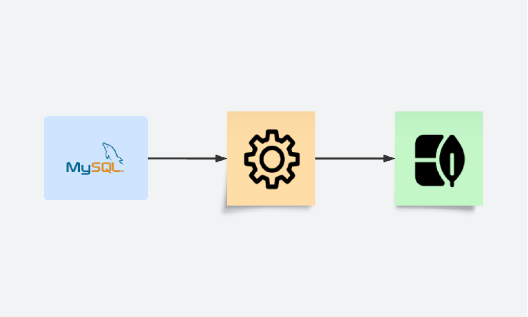

# Introdução ao Apache Airflow

## O que é o Apache Airflow?
O [Apache Airflow](https://github.com/apache/airflow) é uma plataforma para desenvolvimento, agendamento e monitoramento de workflow em batches.

## Workflow como código
A principal característica dos workflows do Apache Airflow é que todos são definidos em forma de código Python. Isso permite maior flexibilidade, versionamento e reutilização de tarefas.

## Principais Componentes do Airflow
- **DAGs (Directed Acyclic Graphs):** Representam o fluxo de trabalho, definindo a ordem e dependências entre as tarefas.
- **Operadores:** Blocos de construção que definem o que cada tarefa faz, como executar scripts Python, rodar consultas SQL, ou interagir com APIs.
- **Scheduler:** Responsável por agendar a execução das tarefas com base nas dependências e horários definidos.
- **Executor:** Gerencia a execução das tarefas, podendo ser local ou distribuído.
- **Web Interface:** Interface gráfica para monitorar, gerenciar e depurar workflows.

## Benefícios do Apache Airflow
- **Escalabilidade:** Suporte para execução de workflows em larga escala.
- **Extensibilidade:** Fácil integração com diferentes sistemas e criação de operadores personalizados.
- **Comunidade Ativa:** Grande número de contribuições e suporte da comunidade open-source.

## Instalação do Apache Airflow

### Usando Python
<details>
<summary>Clique aqui para expandir</summary>

```bash
# 1. Crie um ambiente virtual (opcional, mas recomendado)
python -m venv airflow_env
airflow_env\Scripts\activate  # No Windows
# source airflow_env/bin/activate  # No Linux/MacOS

# 2. Instale o Apache Airflow com o gerenciador de pacotes pip
pip install apache-airflow

# 3. Inicialize o banco de dados do Airflow
airflow db init

# 4. Crie um usuário administrador para acessar a interface web
airflow users create \
    --username admin \
    --firstname Admin \
    --lastname User \
    --role Admin \
    --email admin@example.com

# 5. Inicie o servidor web e o scheduler
# Em um terminal, inicie o servidor web:
airflow webserver
# Em outro terminal, inicie o scheduler:
airflow scheduler
```

6. **Acesse a interface web:**  
   Abra [http://localhost:8080](http://localhost:8080).

</details>

---

### Usando Docker (Simplificado)
<details>
<summary>Clique aqui para expandir</summary>

1. **Configure os diretórios e permissões (Linux):**
   Execute os comandos abaixo para criar os diretórios necessários e configurar as permissões:
   ```bash
   mkdir -p ./dags ./logs ./plugins ./config
   echo -e "AIRFLOW_UID=$(id -u)" > .env
   ```

   Para outros sistemas ou se não precisar configurar o UID, use o padrão:
   ```bash
   echo -e "AIRFLOW_UID=50000" > .env
   ```
   Usando PowerShell:  
   ```powershell
   Write-Output "AIRFLOW_UID=50000" > .env
   ```

2. **Baixe o arquivo `docker-compose.yaml`:**
   - Usando `curl` (em sistemas baseados em Unix ou Git Bash):
     ```bash
     curl -LfO 'https://airflow.apache.org/docs/apache-airflow/2.10.5/docker-compose.yaml'
     ```
   - Usando `Invoke-WebRequest` (em PowerShell no Windows):
     ```powershell
     Invoke-WebRequest -Uri 'https://airflow.apache.org/docs/apache-airflow/2.10.5/docker-compose.yaml' -OutFile 'docker-compose.yaml'
     ```

3. **Inicialize o ambiente do Airflow:**
   Antes de iniciar os serviços, execute a migração da base de dados e crie a primeira conta de usuário:
   ```bash
   docker compose up airflow-init
   ```

4. **Inicie os serviços:**
   Após a inicialização, inicie os serviços com:
   ```bash
   docker compose up
   ```

5. **Acesse a interface web:**  
   Abra [http://localhost:8080](http://localhost:8080).

</details>

---

## Instalação usando Astro CLI
A instalação usando o Astro CLI é uma alternativa simplificada para configurar o Apache Airflow. O Astro CLI é uma ferramenta poderosa para gerenciar ambientes Airflow localmente e na nuvem.

### Como instalar o Astro CLI
Siga as instruções detalhadas no link oficial para instalar o Astro CLI no seu sistema operacional:  
[Guia de instalação do Astro CLI](https://www.astronomer.io/docs/astro/cli/install-cli?tab=windowswithwinget#install-the-astro-cli)

### Passos básicos após a instalação
1. **Inicialize um novo projeto Airflow:**
   Após instalar o Astro CLI, inicialize um novo projeto Airflow com o comando:
   ```bash
   astro dev init
   ```

2. **Inicie o ambiente local:**
   Para iniciar o ambiente Airflow localmente, execute:
   ```bash
   astro dev start
   ```

3. **Acesse a interface web do Airflow:**
   Abra [http://localhost:8080](http://localhost:8080) no navegador para acessar o Airflow.

4. **Parar o ambiente local:**
   Para parar o ambiente, use:
   ```bash
   astro dev stop
   ```

O Astro CLI simplifica o gerenciamento de ambientes Airflow, tornando-o ideal para desenvolvimento local e integração com a nuvem.

## Exemplo de um DAG Simples

<details>
<summary>Clique aqui para expandir</summary>

```python
from datetime import datetime, timedelta

from airflow.models.dag import DAG
from airflow.operators.bash import BashOperator

with DAG(
    "mostra_datas",
    default_args={
        "depends_on_past": False,
        "email": ["airflow@example.com"],
        "email_on_failure": False,
        "email_on_retry": False,
        "retries": 1,
        "retry_delay": timedelta(minutes=5),
    },
    description="A simple tutorial DAG",
    schedule=timedelta(days=1),
    start_date=datetime(2024, 7, 18),
    catchup=True,
    tags=["mostra_datas"],
) as dag:

    t1 = BashOperator(
        task_id="print_date",
        bash_command="echo 'Data definida na operacao: {{ds}}'",
    )

    t2 = BashOperator(
        task_id="sleep",
        depends_on_past=False,
        bash_command="sleep 5",
        retries=3,
    )

    t3 = BashOperator(
        task_id="print_real_date",
        depends_on_past=False,
        bash_command="date -I",
    )

    t1 >> [t2, t3]
```
</details>

## DAGs
Uma **DAG (Directed Acyclic Graph)** é a estrutura central no Apache Airflow. Ela representa um workflow, definindo a ordem e as dependências entre as tarefas. Cada DAG é escrito em Python e descreve como as tarefas devem ser executadas, incluindo agendamento, dependências e configurações específicas.


Neste exemplo a dag consistem em uma tareefa de mostrar no terminal a data agendada da tarefa e o dia que a tarefa foi realmente executada. 


## Um exemplo com Hooks
Este exemplo usa de Hooks do MySQL e do Mongo para ler de uma db e transformar os dados para um formato aceito pelo mongo e carrega-los neste. 



[link da dag](https://github.com/diskrat/dags_airflow/blob/main/basic_etl_dag/basic_etl_dag.py)

Resultando em:
